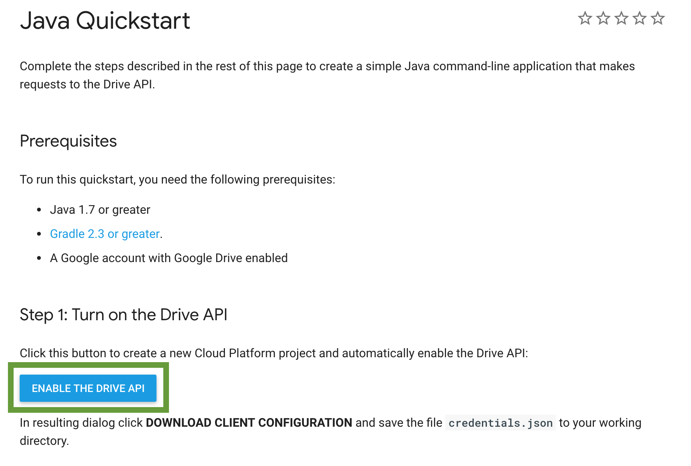
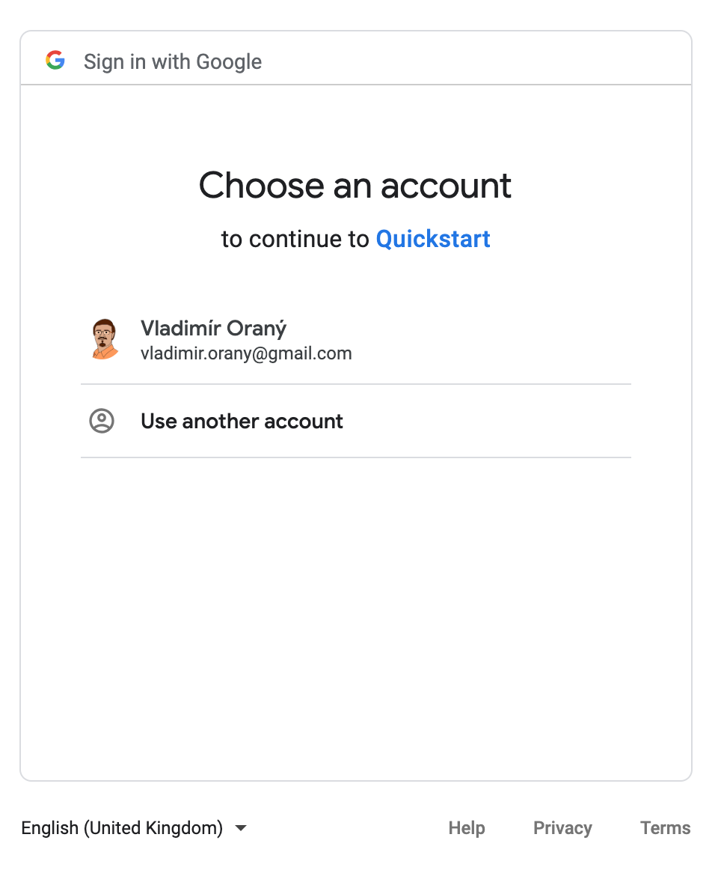
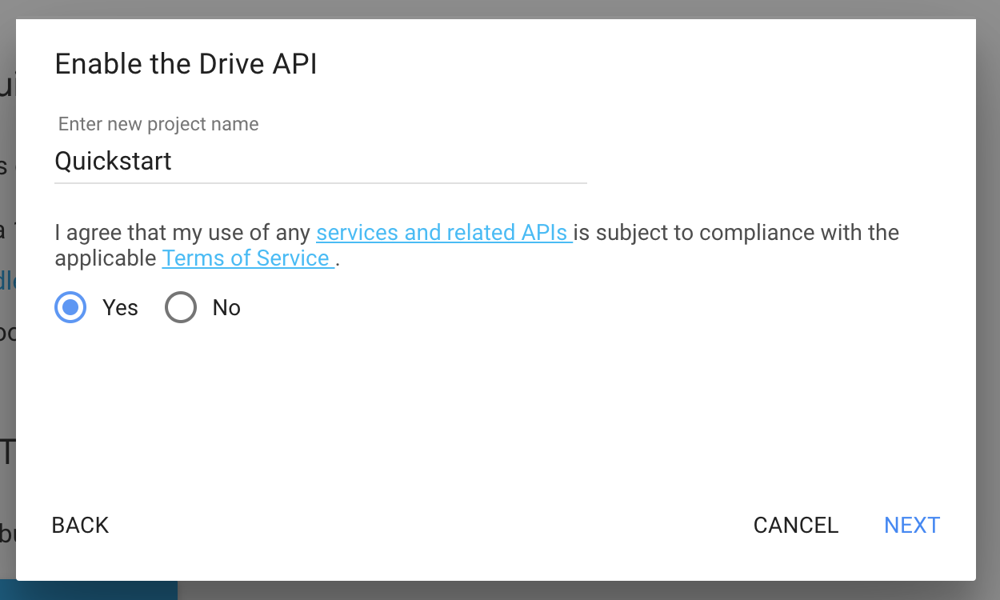
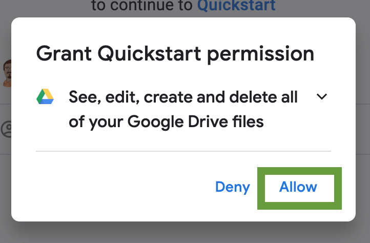
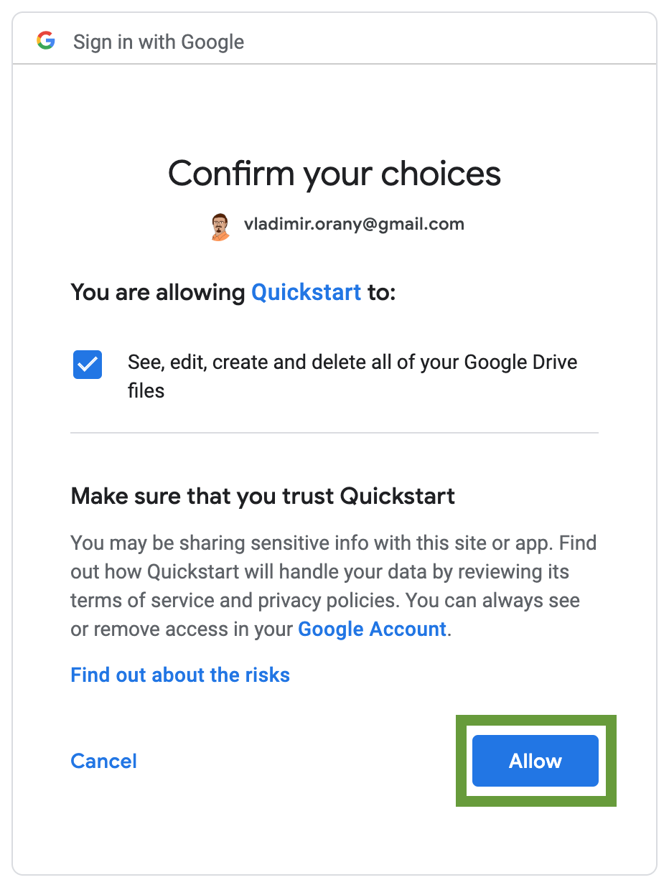
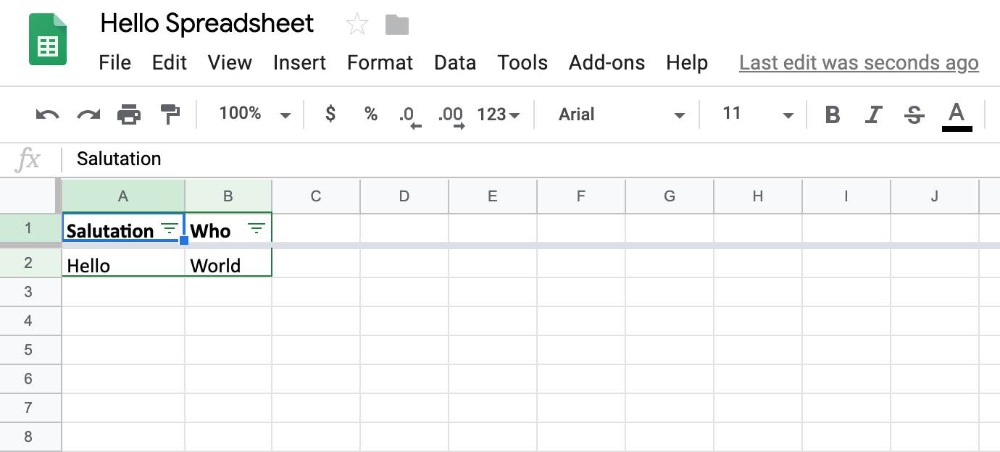

# Google Spreadsheet Builder Starter

You can use this project as a reference for interacting with Google Spreadsheet using the Spreadsheet Builder API.

Please, clone or download the project and follow the guide to start experimenting. 

## Setup the Credentials
Visit [Java Quickstart](https://developers.google.com/drive/api/v3/quickstart/java) page and enable the
Drives API for the Quickstart project.

##### 1. Click the _ENABLE THE DRIVE API_ button

##### 2. (optional if not logged in) Log into your Google Account

##### 3. Enable the API 

##### 4. Download credentials JSON file and copy it into `src/main/resources` folder of the project.

## Run the Application

##### 5. Run the application from the command line using `./gradlew run` or run `App` class from the IDE

##### 6. Grant permissions page will appear in the browser

##### 7. Confirm granting the permissions

##### 8. Spreadsheet page wil appear in the browser

## Explore the Code
Now you can explore the code in [App.java](https://github.com/dsl-builders/google-spreadsheet-builder-starter/blob/master/src/main/java/dsl/builders/spreadsheet/google/starter/App.java)

For more information on using Spreadsheet Builder [see the official documentation](http://spreadsheet.dsl.builders/).